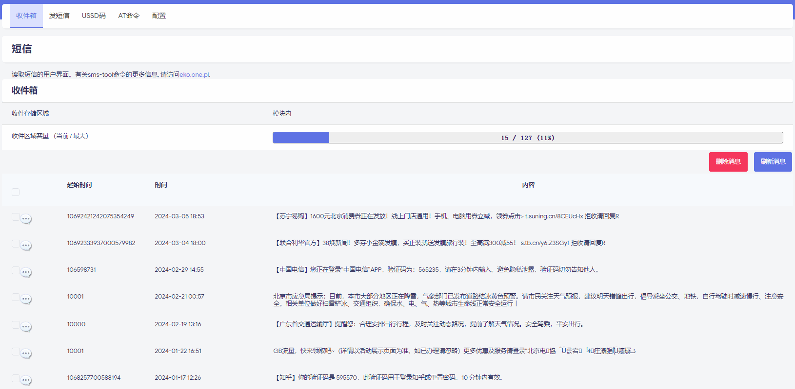
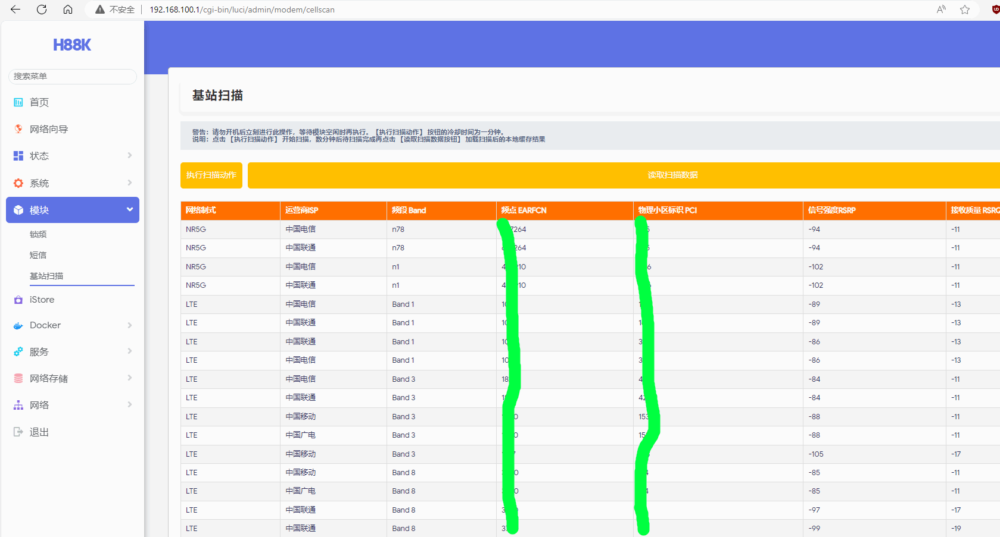
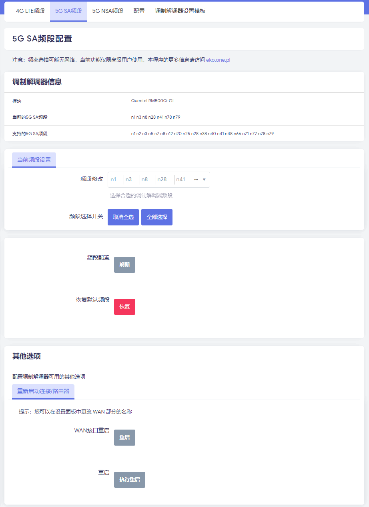

# 测试设备

以下项目皆在OPENWRT 22.03上测试通过，模块仅适用于移远RM500Q和RM520N等，其他请自行修改测试

将以下添加到：openwrt/feeds.conf.default
src-git leux_apps https://github.com/leux0/openwrt-apps.git;main

# 所在路径

 > LuCI > 3. Applications > luci-app-cellscan
 > LuCI > 3. Applications > luci-app-modemband
 > LuCI > 3. Applications > luci-app-sms-tool-js
 > Network > modemband
 > Utilities > sms-tool

# 安装卸载顺序
opkg install modemband sms-tool
opkg install luci-app-modemband luci-app-sms-tool-js luci-app-cellscan
opkg install luci-i18n-modemband-zh-cn luci-i18n-sms-tool-js-zh-cn 

opkg remove luci-i18n-modemband-zh-cn luci-i18n-sms-tool-js-zh-cn 
opkg remove luci-app-modemband luci-app-sms-tool-js luci-app-cellscan
opkg remove modemband sms-tool

# 来源追溯

https://github.com/newton-miku/luci-app-cellscan
https://github.com/4IceG/luci-app-modemband
https://github.com/4IceG/luci-app-sms-tool-js

# 应用展示

